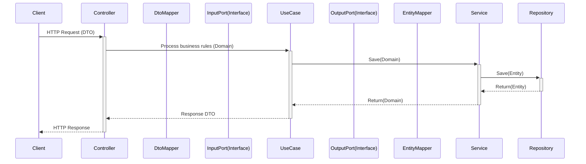

[//]: # (<p align="center">)

[//]: # (  )

[//]: # (</p>)

<h1 align="center">📄 Contract API</h1>

<p align="center">
  <b>Plataforma backend para criação, gestão e versionamento de contratos via interface web</b>
</p>

<p align="center">
  
  
  
  
</p>

---

## ✨ Visão Geral

O **Contract API** é um sistema responsável pela **criação, edição, versionamento e gerenciamento de contratos digitais**, oferecendo uma API REST robusta, segura e escalável.

O projeto foi desenvolvido com foco em:
- **Arquitetura limpa**
- **Separação clara de responsabilidades**
- **Facilidade de manutenção e evolução**

---

## 🧠 Arquitetura

Este projeto segue princípios de:

- Clean Architecture
- SOLID
- Domain-Driven Design (DDD)
- RESTful APIs

```text
├── application
│   ├── core
│   │   ├── domain
│   │   ├── usecases
│   │   ├── exceptions
│   │   └── ports
│   │       ├── input
│   │       └── output
│   ├── adapters
│   │   ├── input
│   │   │    └── controllers
│   │   │        ├── dto
│   │   │        └── docs
│   │   └── output
│   │       └── jpa
│   │           ├── entities
│   │           ├── repositories
│   │           └── services
│   └── config
│       ├── mappers
│       ├── swagger
│       ├── mail
│       ├── security
│       └── beans
```



# 🚀 Funcionalidades

⬜️ Criação de contratos dinâmicos  
⬜ Gerenciamento de cláusulas  
⬜ Versionamento de contratos  
⬜ Validação de regras de negócio  
⬜ Integração via API REST  
⬜ Assinatura digital   
⬜ Auditoria e histórico de alterações  

# 🛠️ Tecnologias Utilizadas

- Java 21
- Spring Boot
- Spring Web
- Spring Data JPA
- Hibernate
- PostgreSQL
- Flyway
- Maven
- Docker

# ⚙️ Como Executar o Projeto
## Pré-requisitos

- Java 21+
- Maven
- PostgreSQL 16
- Docker

## Executando localmente
```
git clone https://github.com/Wagner-Bruggemann/contract-api.git
cd contract-api/backend
mvn clean install
mvn spring-boot:run
```

## A API estará disponível em:

`http://localhost:11000`

# 📚 Documentação da API

## Swagger UI:

http://localhost:11000/swagger-ui.html


## OpenAPI Spec:

http://localhost:11000/v3/api-docs

# 🧪 Testes
```
mvn test
```

# 📝 Padrão de Commits

Este projeto utiliza um padrão de commits que inclui explicitamente o **branch atual** no início da mensagem, facilitando o rastreamento de mudanças em ambientes com múltiplos fluxos de desenvolvimento.

---

### 📌 Estrutura do commit

`[branch] tipo: mensagem curta e objetiva`

##### ✅ Exemplos

`[develop] feat: user authentication`
`[main] fix: prevent null pointer on contract creation`

### 🔖 Tipos de commit

| Tipo | Quando usar |
|-----|------------|
| **feat** | Nova funcionalidade |
| **fix** | Correção de bug |
| **refactor** | Refatoração sem alterar comportamento |
| **perf** | Melhoria de performance |
| **docs** | Alterações em documentação |
| **test** | Criação ou ajuste de testes |
| **style** | Formatação / lint (sem lógica) |
| **chore** | Tarefas de manutenção |
| **ci** | Ajustes em pipeline / CI |
| **build** | Alterações no processo de build |

---

### 🌿 Convenção de branches

Os commits devem refletir o branch em que a alteração foi feita:

- `main` → código estável / produção
- `develop` → desenvolvimento contínuo

---

### ✏️ Boas práticas

- Use **verbo no infinitivo/imperativo** em inglês (add, fix, update)
- Mensagem curta e direta (até ~72 caracteres)
- Um commit deve representar **uma única mudança lógica**
- Use letras minúsculas na mensagem (padrão técnico)

---

### 🚫 O que evitar

```text
[develop] update
[main] final commit
[feature] ajustes
[develop] funcionando
```
<p align="center"> 📌<i> Este padrão melhora a rastreabilidade, leitura do histórico e organização do fluxo de desenvolvimento.</i> </p> 

---

# 🤝 Contribuição

## Contribuições são bem-vindas!  
### Sinta-se à vontade para abrir uma issue ou pull request.

---

# 👨‍💻 Autores

### Wagner Brüggemann 
### Maicon Jordan Rocha

---
<p align="center"> 🚀 <i>Construído com foco em qualidade, arquitetura e evolução contínua</i> </p> 